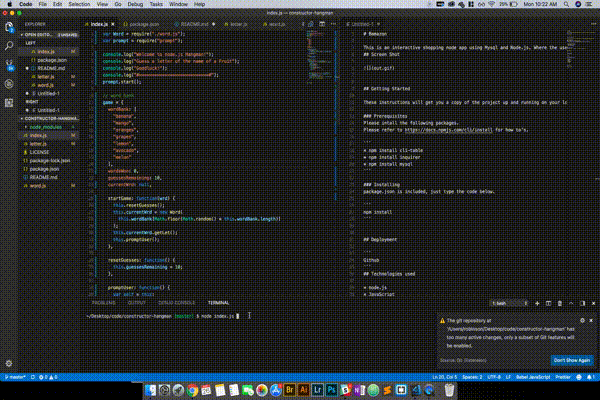

# Constructor-hangman

This is a hangman game using node.js. The user will guess the mystery word by typing a letter character. 



## Getting Started

These instructions will get you a copy of the project up and running on your local machine for development and testing purposes. See deployment for notes on how to deploy the project on a live system.

### Prerequisites
Please intall the following packages.
Please refer to https://docs.npmjs.com/cli/install for how to's.

## Dependencies

```
* inquirer
* prompt
```

## Technologies used

* nbode.js
* javascipt.js
* prompt
* inquirer

## Author 

Robinson Garcia
